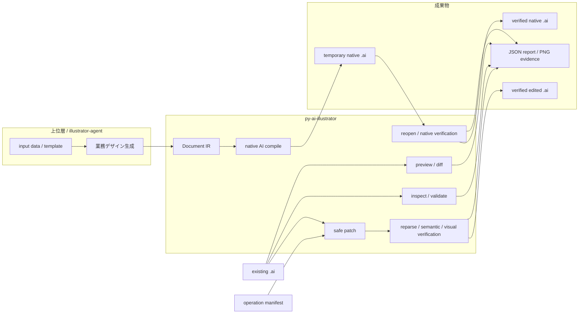

# System overview

このリポジトリは、Adobe Illustratorの業務デザインを生成するアプリケーションではありません。低水準の`Document` IRと`.ai`コンテナの間で、読取・安全編集・検証を行う第1層のcoreと、必要なときだけIllustrator 2026を使うnative backendを提供します。

最初に見るべき境界は次の一枚です。



## 3つの主経路

| 経路 | 入力 | 主な処理 | 出力 | Illustrator |
| --- | --- | --- | --- | --- |
| 新規制作 | 上位層が生成した`Document` IR JSON、必要なら相対リンク画像 | `compile-native`が新規Documentを作成し、DOMを構築、保存、再openして照合 | 検証済みPDF-compatible native `.ai` | 必須。macOS上のIllustrator 2026（30.7.0） |
| 既存編集 | 既存`.ai`とversion 1 operation manifest | selectorとpreconditionを解決し、exact-span patchまたは明示的なnative local-edit profileを実行 | 検証済みの別`.ai` | exact-span patchは不要。native local editはIllustrator 2026必須 |
| 調査・検証 | `.ai` / PDF、または編集前後の2ファイル | container判定、bounded read、構造検証、preview、semantic / visual diff | JSON report、標準出力、PNG evidence | 不要。PDFのraster preview / visual diffはPopplerが必要 |

`illustrator-agent`などの上位層は、データを業務上のcomponentやlayoutへ解釈して`Document` IRを作ります。このリポジトリはその意味を生成せず、受け取ったIRを検証可能な低水準の図形・文字・画像・階層へ変換します。

### Illustrator適合層の内部module

公開互換facadeの`py_ai_illustrator.illustrator`は、既存のPython APIとCLIの入口だけを保持します。実装は責務ごとに次の内部moduleへ分離しています。

| module | 責務 | 依存方向 |
| --- | --- | --- |
| `_illustrator_bridge` | AppleScript、`osascript`、timeout、`CompletedProcess`の境界 | adapterからのみ呼ぶ。IRを知らない |
| `_illustrator_dom` | Python IRの再帰走査、期待構造、DOM snapshot比較、roundtrip semantic比較 | `format` / `legacy` / `model`だけ。subprocessを起動しない |
| `_illustrator_scripts` | ExtendScriptの生成、path/JSON escape、fixture・保存・materialization script | 値のserializationだけ。ファイルを開かない |
| `_illustrator_inspection` | 一時コピーのopen、DOM snapshotのresult組み立て | bridge + scripts + DOM |
| `_illustrator_native_local` | modern AIコピーのlive text/link inventory、atomic edit、save-as、reopen、publish前検証 | bridge + scripts + operation schema + modern/container/visual verification |
| `_illustrator_fonts` | Illustrator font catalogの取得、query、PostScript名検証 | bridge + scripts |
| `_illustrator_fixtures` | Illustratorでfixtureを作成し、legacy readerで検証 | bridge + scripts + DOM + legacy reader |
| `_illustrator_legacy` / `_illustrator_modern` | legacy AI8 / modern PDF-compatible AIのroundtrip adapter | bridge + scripts + inspection + semantic readers |
| `_illustrator_native_materialization` | legacy text/linkをnative TextFrame/PlacedItemへ変換するadapter | bridge + scripts + DOM + assets |

### modern / safe-edit内部module

`modern.py`、`modern_semantic.py`、`modern_writing.py`、`editing.py`は互換facadeです。readerの実装はcontainer → projection → CST、writerの実装はsynchronized patch → target discovery → container / CST、operationの実装はschema → read-only plan → apply orchestrationという依存境界を持ちます。

| module | 責務 | 直接知るもの |
| --- | --- | --- |
| `_modern_container` | PDF構文、object resolution、bounded stream codec、PrivateData section | PDF bytes、limits |
| `_modern_cst` | decoded PrivateDataのlexemeとexact-span CST契約 | decoded segment |
| `_modern_projection` | read-only semantic projectionとunknown / partial evidence | CST、`model` |
| `_modern_discovery` | editable target inventory、representation evidence、停止理由 | projection、source evidence |
| `_modern_patch` | PDF / PrivateData synchronized patch | discovery evidence、container codec、verification |
| `_operation_schema` | version 1 manifest / selector 契約 | JSON schema。plan / orchestrationをimportしない |
| `_operation_plan` | selector resolution、capability evidence、read-only dry-run、expected semantic diff | schema、read-only profile backend。orchestrationをimportしない |
| `_operation_orchestration` | prepared planのapply、atomic output、post-apply semantic / visual validation | schema、plan、mutation backend |

内部moduleは公開facadeを逆向きにimportしません。これにより、既存のimport pathを保ったまま、reader、projection、patch、verificationの保証を個別にテストできます。

bridgeは`Document` parsingやsemantic policyを所有せず、DOM/comparison層はIllustrator processを直接起動しません。実機なしのbridge・script contract・comparisonのテストと、macOS上のIllustrator適合matrixは別の検証境界として維持します。

## 入出力契約

### 入力

- `.ai`の形式は拡張子ではなくcontainer内容で判定します。legacy AI7/AI8は限定subset、PDF-compatible modern AIはread-only semantic profileまたは限定されたsynchronized patch profileの対象です。
- 新規制作の入力はJSON化された`Document` IRです。`examples/minimal-document.json`は、1 layerと1 closed pathだけを持つ最小の実行例です。
- 既存編集の入力は[operation schema](operation-schema.json) version 1のmanifestです。manifestは`operations`と、任意の`source_sha256`を持ちます。selectorは`type`に加えて`id`、`name`、`bounds`、`ancestors`を組み合わせられます。
- `LinkedImage`の`source`は、IR JSONを基準に解決する外部ファイルです。native compileはリンクを外部参照として保持し、埋め込みません。必要なfontとlinkが解決できない場合は成功扱いにしません。

### 出力

| 出力 | 意味 |
| --- | --- |
| `Document` IR JSON | 低水準のpath / text / image / container / artboardとstable ID。`export --to json`はlegacy AIの対応subsetだけを投影します |
| `.ai` | legacy `export --to ai7`のcanonical output、既存AIへのsource-preserving patch output、またはIllustrator 2026で生成するPDF-compatible native output。経路ごとに保証が異なります |
| diagnostic | 未対応feature、読取範囲、source span、severity / code / messageを記録する機械可読の停止・警告情報 |
| verification report | `status`、`checks`、compatibility、semantic diff、PDF display evidence、visual diffなど、成果物を確定できる根拠。native compileは再open後のDOMとcontainerも確認します |
| PNG evidence | legacy IRまたはPDF displayのpreview、あるいは前後差分のheat-map。ピクセル一致そのものではなく、profileで定めた表示証拠です |

### IRと補助契約の役割

- `Document`は、`Artboard`、`Layer`、`Group`、`Path`、`CompoundPath`、`ClippingGroup`、`TextFrame`、`LinkedImage`と、geometry / paint / stacking / stable IDを表します。業務componentや自然言語の指示は含みません。
- operation manifestは「何をどう変えるか」の要求です。現在のsource digest、selector、operationを入力し、`plan`が適用可否と期待diffを返します。
- compile profileは新規Illustrator Documentの条件です。CLIでは`--color-space rgb|cmyk`を指定でき、出力は常にPDF-compatible、linked imageは外部リンクという制約を持ちます。
- diagnosticは「読めたので捨ててよい」という意味ではありません。未対応情報、曖昧なselector、stale source、表現間の不一致を明示し、必要ならfail closedします。
- verification reportは成功メッセージの代わりに、どの保証をどの証拠で確認したかを返します。byte preservation、graphic semantics、visual equivalence、native editabilityは別の保証です。

## CLI contract

全コマンドは`py-ai --help`で確認できます。`-o`はコマンドによってJSON report、PNG、またはAI成果物を意味します。安全編集とnative compileは既存成果物を上書きしません。preview / visual diffは`--force`を明示したときだけ既存PNGを上書きします。JSON exportとJSON reportの書込みは、現在の実装では指定先を置き換えます。

| CLI | 入力 | 出力 | Illustrator | 上書き policy | 保証範囲 |
| --- | --- | --- | --- | --- | --- |
| `inspect` | 1ファイル | stdout（テキストまたは`--json`） | 不要 | 入力変更なし | container、サイズ、marker、modernのbounded read / PDF evidence |
| `export --to json` | legacy AI | IR JSON（stdoutまたは`-o`） | 不要 | `-o`は既存先を置換 | 対応subsetを投影。partial入力は既定で拒否、`--allow-partial`で診断済み情報を落として明示的に許可 |
| `export --to ai7` | IR JSON | legacy AI（`-o`必須） | 不要 | 指定先へ書込み | canonical legacy AI。native current-format AIではない |
| `plan` | AI + operation manifest | stdout JSON | 不要 | ファイル変更なし | selector、precondition、期待semantic diff、legacyのbyte-preserving範囲をdry-run |
| `apply` | AI + operation manifest + 新規出力先 | verified AI + stdout JSON report | 不要（modern patchはPopplerが必要） | 入力を変更せず、既存出力を拒否 | legacyはreplacement span外のbyte一致、modernは対応するPDF / PrivateDataとvisual impactを検証 |
| `inspect-native-local` | PDF-compatible AI | stdout JSON | 必須 | 入力の一時コピーだけをopen | live text / linked imageのDOM selectorとstyle/geometry/link evidence |
| `plan-native-local` | PDF-compatible AI + operation manifest | stdout JSON | 必須 | 入力の一時コピーだけをopen | source digest、asset、DOM selectorを解決しatomic batchをdry-run |
| `apply-native-local` | PDF-compatible AI + operation manifest + 新規出力先 | verified AI + visual diff + stdout JSON | 必須（Popplerも必要） | copyを編集し、全gate後だけ新規出力を確定 | save前・再open後DOM、font/link/editability、container、timestamp、target限定visual diff、source不変 |
| `validate` | 1ファイル | stdout JSON | 不要 | 入力変更なし | 利用可能なcompatibility、container、PDF display、modern representationの構造検証。`safe_to_reserialize`はlegacy profileの値 |
| `diff --semantic` | legacy AI 2個 | stdout JSON | 不要 | ファイル変更なし | stable IDによるsemantic差分。legacy AIだけを対象 |
| `diff --visual` | AI / PDF 2個 + PNG先 | stdout JSON + heat-map PNG | 不要（PDFはPoppler） | 既存PNGは`--force`なしで拒否 | 同一raster条件でchanged pixels、ratio、bounds、channel差を記録 |
| `preview` | AI / PDF + PNG先 | stdout JSON + PNG | 不要（PDFはPoppler） | 既存PNGは`--force`なしで拒否 | legacy IRまたはPDF displayの決定的preview |
| `compile-native` | `Document` IR JSON + 新規`.ai`先 | verified native `.ai` + stdout JSON report | 必須 | 既存出力を拒否。temp出力を検証してから確定 | Illustrator DOMを作成し、保存後に再open、階層・順序・geometry・paint・text・link・native editability・PDF-compatible containerを検証 |
| `materialize-native` | legacy AI + 新規`.ai`先 | native editable `.ai` + stdout JSON report | 必須 | 既存出力を拒否 | legacy textをnative TextFrameへ変換し、font、paragraph、identity、link、再open後の属性を検証 |
| `test-illustrator` | AI | stdoutまたは`-o` JSON report | 必須 | 入力は一時コピーだけをopen。report先はCLI writerが置換 | 実機でopenし、layer / page item / text / link構造を確認。入力は保存しない |
| `illustrator-fonts` | query / required PostScript名 | stdoutまたは`-o` JSON report | 必須 | report先はCLI writerが置換 | Illustratorが見えるfontと正確なPostScript名を確認 |
| `test-illustrator-export` | fixture名、任意の`--ai-output` | AI8 fixture（任意） + JSON report | 必須 | `--ai-output`は既存先を拒否 | Illustratorでfixtureを作り、AI8保存後にPython IRへ読み戻して確認 |
| `test-illustrator-roundtrip` | legacy AI、任意の`--ai-output` | 再保存AI（任意） + JSON report | 必須 | `--ai-output`は既存先を拒否 | Illustrator AI8再保存前後のlegacy IRを比較。version依存のadvisory lossは別報告 |
| `test-illustrator-modern-roundtrip` | PDF-compatible AI、任意の`--ai-output` | current-format AI（任意） + JSON report | 必須 | `--ai-output`は既存先を拒否 | open、current-format再保存、再open、PrivateData、PDF display、native editability、bounded visual normalizationを確認 |

`Illustrator必須`のコマンドは、macOS上でIllustrator 2026がインストール・認証済みで応答可能であることをruntime条件とします。環境が使えない場合は、成果物が検証済みだと扱わず`environment-unavailable`を返します。詳しい実機手順は[Illustrator適合試験](illustrator-testing.md)を参照してください。

## 最小 end-to-end 例

この例は、リポジトリ内の最小IRを入力にして、Illustrator 2026でnative `.ai`を生成し、compileの再open検証結果を得ます。出力先を毎回新しい一時ディレクトリにすることで、既存ファイルの上書き拒否にも適合します。

入力: [`examples/minimal-document.json`](../examples/minimal-document.json)

```bash
workdir="$(mktemp -d)"
uv run py-ai compile-native \
  examples/minimal-document.json \
  -o "$workdir/minimal.native.ai"

# compile-nativeのreportがpassedになった後の、Illustratorなしのcontainer確認
uv run py-ai inspect "$workdir/minimal.native.ai" --json
```

成功時の最初のコマンドは、`status: "passed"`、PDF-compatible AIのformat、再open後の構造・属性checkを含むJSONをstdoutへ返します。Illustratorを使えない環境ではこの経路は実行できませんが、入力IRの読み込み・validationやlegacyのpreview / export / patchは引き続きIllustratorなしで検証できます。

## 責務の境界

```text
illustrator-agent -> py-ai-illustrator
```

`illustrator-agent`は、業務デザインcomponent、layout、theme、自然言語workflow、データからの制作計画を担当します。`py-ai-illustrator`は、受け取った低水準IR、既存AI、operation manifestを安全に変換・編集・検証します。このrepoには、商品カードやバナーなどの業務上の意味を生成する機能は含まれません。新しいcore機能は、具体的なfixture、operation、保持条件、検証可能な完了条件が揃ったときに追加します。

保証の詳細は[アーキテクチャ](architecture.md)、legacyの範囲は[legacy feature profile](legacy-feature-profile.md)、modernのread / write範囲は[modern read profile](modern-ai-read-profile.md)と[modern write profile](modern-ai-write-profile.md)、runtime local editは[Illustrator native local-edit profile](modern-ai-native-local-edit-profile.md)、native制作の判断は[ADR 0002](adr/0002-direct-native-authoring-backend.md)を正とします。
